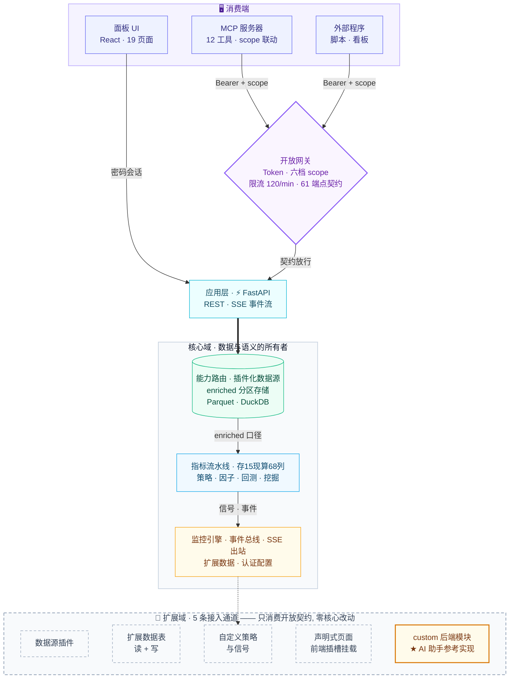
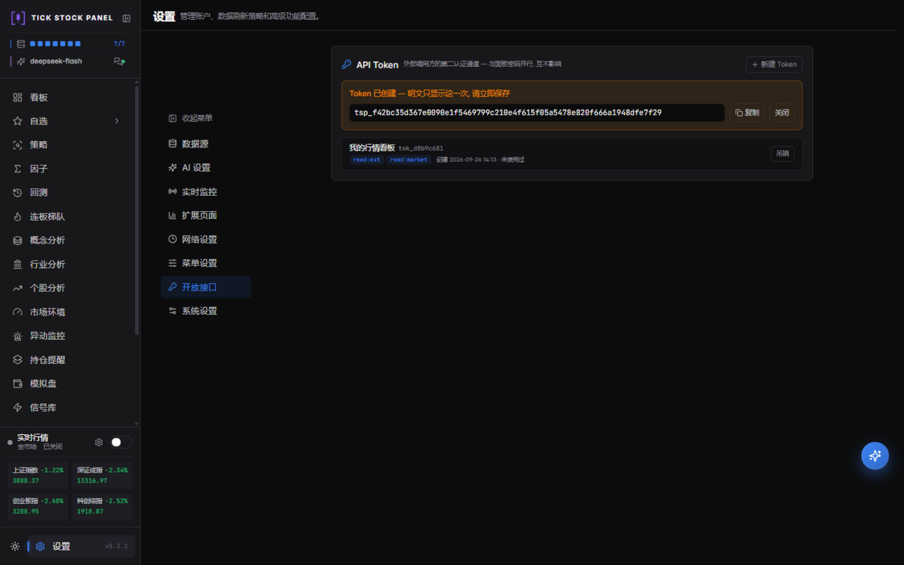
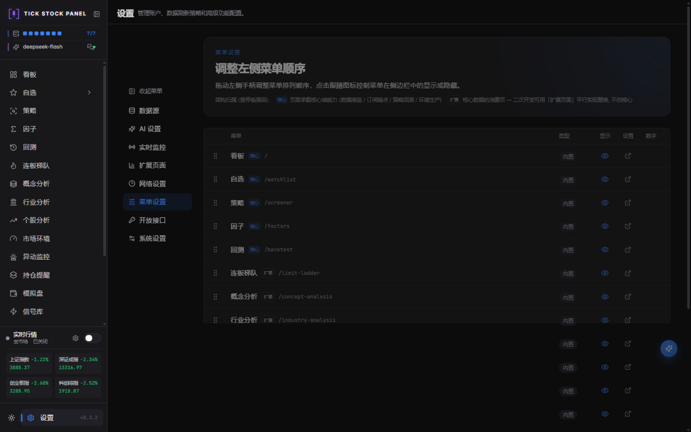
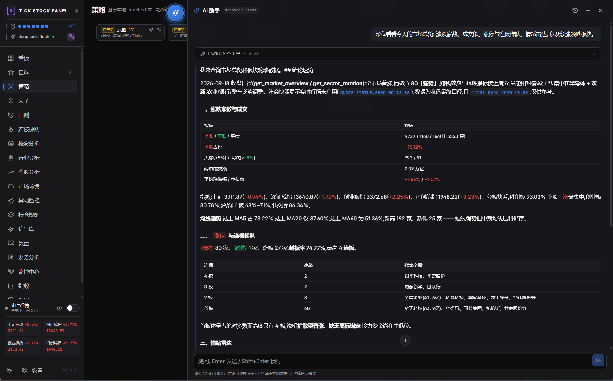

<div align="center">

# <picture><source media="(prefers-color-scheme: dark)" srcset="brand/logo-dark-title.svg"></picture> TSP · A股智能量化工作台

<br/>

[](https://github.com/shy3130/tick-stock-panel)
[](./LICENSE)
[](https://pola.rs/)
[](./docs/open-platform-plan.md)
[](./mcp-server/README.md)

[](https://github.com/shy3130/tick-stock-panel/actions/workflows/docker.yml)
[](https://github.com/shy3130/tick-stock-panel/actions/workflows/ci.yml)
[](https://github.com/shy3130/tick-stock-panel/stargazers)

**自托管 · 零运维 · 核心能力全部开放成接口的 A 股量化工作台**

[](https://tsp.shy313.com/)

`选股` · `回测` · `监控` · `因子挖掘` · `AI 助手` · `Open API` · `MCP`

<a href="https://trendshift.io/repositories/64327?utm_source=repository-badge&amp;utm_medium=badge&amp;utm_campaign=badge-repository-64327" target="_blank" rel="noopener noreferrer"></a>
<a href="https://trendshift.io/repositories/64327?utm_source=trendshift-badge&amp;utm_medium=badge&amp;utm_campaign=badge-trendshift-64327" target="_blank" rel="noopener noreferrer"></a>

<table>
<tr><td align="center"><big><b>61</b></big><br/><sub>开放 API 端点</sub></td>
<td align="center"><big><b>6</b></big><br/><sub>Token 权限档</sub></td>
<td align="center"><big><b>12</b></big><br/><sub>MCP 工具</sub></td>
<td align="center"><big><b>2400+</b></big><br/><sub>测试全绿 · CI 守护</sub></td>
<td align="center"><big><b>ms 级</b></big><br/><sub>全市场策略扫描</sub></td>
<td align="center"><big><b>1 容器</b></big><br/><sub>零外部数据库</sub></td></tr>
</table>

**[✨ 核心功能](#-核心功能)** · **[📸 界面预览](#-界面预览)** · **[🏛️ 架构](#-架构)** · **[⚡ 性能](#-性能)** · **[🌐 开放能力](#-开放能力open-api--mcp)** · **[🚀 快速开始](#-快速开始)** · **[📚 完整文档](#-完整文档)**

</div>

---


<div align="center">

<a href="https://www.runninghub.ai/call-api?source=github&inviteCode=edt5wh7c" target="_blank" rel="noopener noreferrer">
  
</a>

<a href="https://www.runninghub.ai/call-api?source=github&inviteCode=edt5wh7c" target="_blank" rel="noopener noreferrer">
  
</a>

**本项目由 [RunningHub](https://www.runninghub.ai/call-api?source=github&inviteCode=edt5wh7c) 提供支持** · 单一接口直连 400+ 主流大模型 · 免费测试

</div>

---

> [!IMPORTANT]
> ⚠️ 本项目谨作为本地量化提供解决思路与方案，**不作为投资软件或者看盘软件**。**明确不做**：不对标同花顺 / 通达信，不内置「AI 荐股 / 涨停预测」。数据源已插件化，可任意接入第三方数据源。仅供学习研究使用。

📮 有任何项目问题可邮件联系 **415333856@qq.com** · 觉得有用请点个 ⭐ Star

---

## 💡 为什么做 TSP

| 用脚本/拼凑工具做量化,你大概率遇到过         | TSP 的解法                                                                                               |
| :------------------------------------------- | :------------------------------------------------------------------------------------------------------- |
| 数据源绑死,换一家要重写整套拉数代码          | **能力路由矩阵**:6 类数据集按源能力独立路由,随时换源,指标与回测口径不变                                  |
| 选股、回测、监控各用一套工具,口径对不上      | 全站统一 **enriched 数据口径**:选股 → 回测 → 监控 → 复盘一条链                                           |
| 盘中异动靠人盯盘,错过就是错过                | **竞价/盘中/偏移**全时段异动 + 实时弹窗、语音播报、飞书推送                                              |
| 想查个数据要在几个页面之间来回点             | **AI 对话助手**:一句话问出全站数据,取数过程逐条可见、可展开核对;还能经确认卡放行生成信号、跑回测、补数据 |
| 想基于面板数据做自己的工具/机器人,只能爬页面 | **开放接口 + MCP**:Token 六档权限、61 端点契约化、SSE 事件流,AI 客户端即插即用                           |
| 付费终端贵、云端平台数据出不了本地           | **自托管**:Docker 单容器,数据全部落在本地 Parquet,零运维                                                 |

## ✨ 核心功能

<table>
<tr>
<td width="33.3%" valign="top">

**🔀 能力路由**<br/>6 类数据集按源能力独立路由, 换源不换口径

</td>
<td width="33.3%" valign="top">

**🔍 选股引擎**<br/>25 内置策略 + 自定义信号 + AI 生成, 毫秒级扫全 A 股

</td>
<td width="33.3%" valign="top">

**📊 指标流水线**<br/>68 列指标与信号, 一次扫表落盘 enriched Parquet

</td>
</tr>
<tr>
<td width="33.3%" valign="top">

**🧪 回测研究**<br/>因子/策略/分钟回测, T+1/费用/滑点, 因子归因

</td>
<td width="33.3%" valign="top">

**🔬 因子平台**<br/>DSL 自定义因子 + 检验组合, 与策略双向联动

</td>
<td width="33.3%" valign="top">

**⛏️ 因子挖掘**<br/>样本外搜索多因子组合, 显式发布、永不上线

</td>
</tr>
<tr>
<td width="33.3%" valign="top">

**🌡️ 市场环境**<br/>情绪周期 6 阶段 + 概念/行业主线排名

</td>
<td width="33.3%" valign="top">

**🚨 异动监控**<br/>竞价/盘中/偏移三类异动一页覆盖

</td>
<td width="33.3%" valign="top">

**📡 监控中心**<br/>四类规则 AND/OR + 语音播报 + 飞书推送

</td>
</tr>
<tr>
<td width="33.3%" valign="top">

**📈 个股分析**<br/>9 类关键价位 + AI 四维分析

</td>
<td width="33.3%" valign="top">

**🏆 连板梯队**<br/>连板统计 + 概念轮动 + 盘后 AI 复盘

</td>
<td width="33.3%" valign="top">

**🧰 数据扩展**<br/>插件化数据源, 扩展字段成页, 按日历史回补

</td>
</tr>
<tr>
<td width="33.3%" valign="top">

**🌐 开放接口**<br/>Token 六档权限, 61 端点契约化, 读+写闭环

</td>
<td width="33.3%" valign="top">

**🔌 MCP 服务器**<br/>12 个工具把面板能力交给任意 AI 客户端

</td>
<td width="33.3%" valign="top">

**🧠 AI 对话助手**<br/>一句话问全站数据, 工具足迹逐条可核对

</td>
</tr>
</table>

<details>
<summary><b>📦 主要页面与功能</b></summary>

**📊 行情总览**

- **看板** Dashboard — 市场情绪评分 + 涨跌/成交额榜单 + 概念/行业领涨领跌(点击板块直达成分股,领涨股带涨跌幅) + 大盘异动事件流,一日全貌; **布局可自定义** — 12 列吸附网格, 组件拖拽换位/角柄自由调宽高, 可增删组件、嵌入外部链接(iframe 沙箱), 跨设备同步, 一键恢复默认
- **自选** Watchlist — 自选股池,多分组管理(M:N),表格/卡片双视图,换手/量比/RSI 等实时指标,按档位分流实时刷新
- **指数** Indices — 沪深指数浏览与同步

**🔍 选股与回测**

- **策略** Screener — Polars 毫秒级扫描全 A 股,日线/分钟策略统一单池,按策略声明周期自动路由执行
- **回测** Backtest — 四种研究视图:
  - **因子回测** — IC/IR、分层收益、多空组合,62+ 因子目录先筛掉无效指标
  - **策略回测** — 净值曲线、回撤、夏普、胜率、盈亏比、蒙卡回撤,T+1/手续费/滑点/止损,SSE 流式进度;评分因子策略附带「因子归因」(胜/败单入场信号日因子对比)
  - **分钟策略回测** — 逐交易日回放信号、分钟收盘入场,分钟级成交明细
  - **验证** — 参数敏感性与滚动样本外
  - 研究闭环:结果导出 CSV(概要/净值/交易明细/分标的统计) → 保存候选 → **一键载入复测**
- **因子** Factors — 检验/因子库/编辑器/组合四 tab:IC·分层·Newey-West 检验、自定义 DSL 因子(25 算子点选、双语字段、我的因子模板)、版本与生命周期管理;因子库可**一键生成排名策略**,策略触发器可直接引用因子条件
- **挖掘** Mining — 嵌套样本外因子与策略挖掘:训练区间因子方向重估 + 相关性去重 + 多因子排名组合搜索,自有策略作对照轨;候选入库,显式确认后才发布,永不自动上线

**📈 个股与板块分析**

- **个股分析** Stock Analysis (Beta) — 日K + 9 类关键价位 + AI 四维分析(技术/基本面/财务/消息面)
- **财务分析** Financials — 利润表/资负表/现金流/关键指标(多源并集合并,fuyao 财务四表适配) + AI 解读
- **概念分析 / 行业分析** — ths 维度涨幅轮动矩阵 + 领涨/领跌主线 + 个股穿透
- **市场环境** Regime — 情绪周期 6 阶段(冰点/启动/主升/高潮/退潮/修复,连板梯队驱动,EMA 平滑 + 2 日确认)+ 概念/行业主线排名,与 5 档环境分并存
- **连板梯队** Limit Up Ladder — 连板层级统计 + 概念/行业分布 + 封单监控(可切换连跌梯队)

**🔔 监控与复盘**

- **监控中心** Monitor — 策略/个股信号/价格/异动四类规则,支持自选分组作用域,盘中实时弹窗 + 语音播报(播报个股名称与信号) + 触发记录持久化
- **持仓提醒** Lots — 记录个股/ETF 买入批次,自动生成止盈止损/到期监控规则
- **信号库** Signals — 内置预计算信号 + 自定义条件信号(含因子条件与 AI 生成),供策略触发器/回测/监控统一取用
- **异动监控** Abnormal Moves — 按交易时间线三 tab:
  - **竞价异动** — 同花顺盘前风向标(含当日/次日真实收益对照、追高风险标记)+ 全市场竞价扫描(待采集任务)
  - **盘中异动** — 涨停/炸板/翘板/跌停/新高/新低/放量当日信号聚合,零新增采集
  - **偏移异动** — 交易所异动偏离值口径(主板 3 日 ±20%、创业板/科创板 ±30%、北交所 ±40%;10 日 +100%/−50%、30 日 +200%/−70%),实时接近度
- **复盘** Review (Beta) — 盘后 AI 自动生成市场复盘,注入龙虎榜资金动向与盘前风向标对照;可定时执行、推送飞书、下载 Markdown

**🗄️ 数据与扩展**

- **数据** Data — 本地数据画像与同步状态(维表/日K/除权/Enriched/指数/ETF/分钟K/财务),盘后管道与历史扩展
- **扩展分析** (动态菜单) — 把任意第三方/扩展数据字段配成一级菜单,与内置数据同台分析
- **设置** Settings — 数据源与能力检测(能力路由矩阵、档位徽章)、AI 接口、实时监控、扩展页面、开放接口(Token 管理)、菜单与系统设置

**🤖 AI 助手**

- **AI 对话助手** — 悬浮球 / 侧栏 AI 徽标旁入口 / ⌘K 呼出; 21 个查询工具覆盖个股·大盘·板块·自选·持仓·信号·策略·因子·数据完整性·扩展数据表, 外加 4 个**动作工具**(生成信号策略 / 回测 / 加自选 / 数据补全)——写操作先弹**确认卡**(完整待执行参数可见, 确认/取消/120s 超时自动取消)才执行; 逐字流式输出 + 工具调用足迹卡(参数与耗时可展开核对), 每条回答附风险与数据口径提示; 完全解耦的扩展模块, 删除目录即卸载

</details>

---

## 📸 界面预览

<table>
  <tr>
    <td width="50%" align="center"><b>看板 Dashboard</b></td>
    <td width="50%" align="center"><b>策略 Screener</b></td>
  </tr>
  <tr>
    <td width="50%"></td>
    <td width="50%"></td>
  </tr>
  <tr>
    <td width="50%" align="center"><b>回测 Backtest</b></td>
    <td width="50%" align="center"><b>挖掘 Mining</b></td>
  </tr>
  <tr>
    <td width="50%"></td>
    <td width="50%"></td>
  </tr>
  <tr>
    <td width="50%" align="center"><b>监控中心 Monitor</b></td>
    <td width="50%" align="center"><b>市场环境 Regime</b></td>
  </tr>
  <tr>
    <td width="50%"></td>
    <td width="50%"></td>
  </tr>
</table>

<div align="center">

### 📸 [查看更多界面截图 »](./screenshots/README.md)

</div>

---

## 🏗️ 架构

**TSP 是一个"数据工程优先"的本地量化工作台** —— 数据源、口径、执行、开放通道做成一套自洽的架构,功能只是长在上面的应用。八个特点,一句话一个:

| 架构特点 | 一句话说明 |
| :--- | :--- |
| 🔀 **能力路由矩阵** | 6 类数据集按源声明能力独立路由——换源不换口径,指标与回测结果不变 |
| 🧬 **单一 enriched 口径** | 只存 15 列基础数据、现算 68 列指标信号;选股 → 回测 → 监控 → 复盘吃同一份数据 |
| 📁 **文件型零运维存储** | Parquet + DuckDB,单容器零外部数据库,数据 100% 落在本地 |
| 🔁 **回测 = 实盘同路径** | 策略执行只此一条 `StrategyEngine.run`;分钟策略逐日回放 +「当日已知」纪律,杜绝未来函数 |
| 🏛️ **网关居中的开放单体** | 面板密码会话与 Token 网关双通道并行;61 端点契约快照 + CI 守护,SSE 事件流与 MCP 平等开放 |
| 🧩 **核心域 / 扩展域边界** | 8 个核心域拥有数据与语义,5 条扩展通道只消费契约——删除目录即整体卸载,零核心改动 |
| 🚀 **重活进程隔离** | 回测跑在 spawn worker 子进程,刷新/切页重连不丢任务,主服务永不被计算卡住 |
| 📅 **交易日探针** | 节假日自动停掉实时轮询与分钟增量,零无效请求 |

### 总览 · 网关居中的开放单体


> **双通道并行**:面板走密码会话,外部走 Token 网关 —— 互不影响、互不挤占限流。核心域 8 个域是数据与语义的所有者;扩展域 5 条通道只消费契约,零核心改动。



### 核心域 / 扩展域边界

按「**数据与语义的归属 + 依赖箭头方向**」划分,而非页面外观:

|                     | 内容                                                                                                                   | 划线依据                                  |
| :------------------ | :--------------------------------------------------------------------------------------------------------------------- | :---------------------------------------- |
| **核心域 · 8**      | 数据底座 / 能力路由 / 订阅锚点(自选) / 策略与回测 / 因子与挖掘 / 环境数据生产 / 监控推送管道 / 扩展数据存储 + 认证配置 | 被多个模块消费其数据与语义,自身不依赖外围 |
| **扩展域 · 5 通道** | 数据源插件 · 扩展数据表 · 自定义策略/信号 · 声明式页面/前端插槽 · 后端 custom 模块                                     | 只消费核心契约,可整体替换/移除而不伤核心  |

设置 → 菜单设置里每个页面带 `核心 / 扩展` 徽标与归属原因;11 个内置页面(概念/行业/个股/财务分析、监控中心、异动、持仓提醒、模拟盘、信号库、复盘、连板梯队)都是**可被二开替换的消费页** —— 例如监控中心页面可换,规则引擎与推送管道属核心照常运行。详见 [docs/open-platform-plan.md](./docs/open-platform-plan.md)。

### 关键机制

| 机制                 | 说明                                                                                                                                                                                                                     |
| :------------------- | :----------------------------------------------------------------------------------------------------------------------------------------------------------------------------------------------------------------------- |
| **能力路由矩阵**     | 各数据集按源声明能力独立路由,注册表集中定义、可扩展:TICKFLOW 档位探测(None/Free/Starter/Pro/Expert)+ 插件源能力声明,fail-closed(声明 `pct_unit` 未声明即拒)。同一数据集可随时换源,指标与回测口径不变                     |
| **交易日探针**       | fuyao 交易日历(确定性,含调休)→ tickflow 全市场行情时间戳探针(OR 语义)→ 工作日兜底;节假日自动停掉实时轮询与分钟增量,零无效请求                                                                                            |
| **财务多源合并**     | 按 `(symbol, period_end)` 报告期累积,多源取并集、逐列按公告日取最新(PIT);公告前一律空值,绝不填 0                                                                                                                         |
| **非路由数据集直连** | 龙虎榜/盘前风向标/交易日历等 fuyao 专有能力不进路由矩阵,由独立服务直连消费——按日 JSON 缓存(历史不可变)、交易日回退、四态降级                                                                                             |
| **回测执行隔离**     | 回测在 spawn worker 子进程运行,持久 run ID,刷新/切页重连不丢任务;子进程结果消息经锁保护回传                                                                                                                              |
| **分层缓存**         | enriched 读取时现算指标(存储仅 15 列基础数据,现算 68 列指标与信号)+ 进程内快照缓存;扩展字段按日分区快照,页面即配即用                                                                                                     |
| **开放网关**         | Token 通道与面板密码会话并行互不影响:认证 → 六档 scope 校验 → 每 Token 滑动窗口限流(默认 120 次/分,O(1) 内存)→ 放行;管理面(数据同步/表结构/设置)永不开放给 Token                                                         |
| **事件总线**         | 进程内发布/订阅(慢消费者丢旧保新,广播失败不反噬主流程),告警落盘唯一入口已挂接;SSE 流按票据 scope 过滤,票据一次性 60 秒过期                                                                                               |
| **完全解耦扩展**     | 后端 `app/custom/<包>/` 启动时自动发现、注册独立路由(版本不符或 setup 失败即隔离跳过), 前端 `src/custom/*/extension.tsx` 构建时自动挂载到插槽; 删除目录即整体卸载, 扩展无需改动核心 —— **AI 对话助手**即该机制的参考实现 |

### 技术栈

| 层           | 选型                                                                                                                                                                                                                                                                                                                                                                                                                                                                                                                                                                      |
| :----------- | :------------------------------------------------------------------------------------------------------------------------------------------------------------------------------------------------------------------------------------------------------------------------------------------------------------------------------------------------------------------------------------------------------------------------------------------------------------------------------------------------------------------------------------------------------------------------ |
| **后端**     |    APScheduler · sse-starlette                                                                                                                                                                                                                                                                       |
| **数据**     | （计算）· （查询）· Parquet（存储）                                                                                                                                                                                                                                                                                                                                                                     |
| **回测**     | 自研仓位模拟引擎(T+1/费用/滑点/分钟回放)· vectorbt(部分路径)                                                                                                                                                                                                                                                                                                                                                                                                                                                                                                              |
| **数据源**   | [TickFlow](https://tickflow.org/auth/register?ref=V3KDKGXPEA) 官方 SDK · fuyao(同花顺 REST) · 插件化扩展(stock-sdk 示例插件 · YAML 自定义源)                                                                                                                                                                                                                                                                                                                                                                                                                              |
| **AI**(可选) |  DeepSeek / 通义 / Ollama 等 · 策略生成 / 报告 / **对话助手**(助手依赖工具调用能力, 需 OpenAI 兼容接口)                                                                                                                                                                                                                                                                                                                                                                          |
| **MCP**      | [mcp-server](./mcp-server/README.md)(官方 SDK 2.x, stdio) — 12 工具按 scope 暴露,权限裁决复用开放网关                                                                                                                                                                                                                                                                                                                                                                                                                                                                     |
| **前端**     |     Tanstack Query · [Lightweight Charts](https://www.tradingview.com/lightweight-charts/)(TradingView 开源) ·  · dnd-kit |
| **部署**     |  两阶段构建,前端 dist 拷进后端镜像                                                                                                                                                                                                                                                                                                                                                                                                                                                |

---

## ⚡ 性能

不是口号 —— 每一行都有机制支撑,数字全部来自本仓库的真实测试与实现。

### 核心引擎

| 场景           | 表现                                                              | 靠什么                                         |
| :------------- | :---------------------------------------------------------------- | :--------------------------------------------- |
| 全市场策略扫描 | **毫秒级**                                                        | Polars 列式引擎 + enriched 预计算,谓词下推过滤 |
| 指标与信号     | 只存 **15 列**基础数据,现算 **68 列**指标信号                     | 分层缓存:存储最小化、读取零冗余、写入即失效    |
| 盘后管道       | 增量分区,只算新交易日                                             | enriched 按日分区 + 指标流水线增量帧           |
| 实时行情       | 自选优先,全市场按档位分流                                         | 交易日探针,节假日自动停轮,零无效请求           |
| 回测           | 子进程隔离不卡主服务,刷新重连不丢任务                             | spawn worker + 持久 run ID + 重活并发闸        |
| 部署与兼容     | 单容器**零外部数据库**(Parquet + DuckDB 文件型) · 新老 CPU 双内核 | polars rtcompat 兼容内核,运行时自动探测        |

### 开放层(0.3.2 新架构带来)

| 能力         | 表现                                | 靠什么                                     |
| :----------- | :---------------------------------- | :----------------------------------------- |
| 开放 API     | **61 端点** · 每 Token 120 次/分    | 进程内滑动窗口限流,O(1) 内存,零外部依赖    |
| 网关裁决     | 认证→scope→限流,纯内存单函数完成    | 单一裁决点(`evaluate`),无数据库往返        |
| 契约稳定性   | 机器可读契约 + **快照测试**守护     | 开放面增删必须显式改快照,CI 拦截无意识变更 |
| 数据写闭环   | 外部写入复用管理端同一校验/落盘路径 | `write:ext` 只写行数据,表结构锁死管理面    |
| 事件推送     | 告警落盘即广播,**亚秒级**到 SSE 流  | 进程内事件总线(丢旧保新)+ 一次性票据订阅   |
| MCP 工具调用 | 12 工具按 scope 联动暴露            | 薄桥零业务逻辑,权限裁决复用网关            |
| 质量保障     | **2400+ 测试全绿,约 100 秒跑完**    | GitHub Actions CI(后端全量 + 前端构建)     |

---

## 🌐 开放能力(Open API + MCP)

面板的核心能力不只长在页面上 —— **全部开放成受控接口**,外部程序与 AI 客户端平等消费:

> 🌐 **开放平台门户已上线 → [tsp.shy313.com](https://tsp.shy313.com/)**
> 浏览 TSP 全部功能 · 注册账户 · 邀请好友 · 创建 API Key · 在线调用开放接口,一个入口直达。

<table>
  <tr>
    <td width="50%" align="center"><b>设置 → 开放接口 · Token 管理</b><br/><sub>明文只显示一次,六档 scope 按需授予</sub></td>
    <td width="50%" align="center"><b>设置 → 菜单设置 · 架构标注</b><br/><sub>每页核心/扩展徽标,悬停看归属原因</sub></td>
  </tr>
  <tr>
    <td width="50%"></td>
    <td width="50%"></td>
  </tr>
</table>

| 能力            | 说明                                                                                                                                                                           |
| :-------------- | :----------------------------------------------------------------------------------------------------------------------------------------------------------------------------- |
| **API Token**   | `设置 → 开放接口` 创建,明文只显示一次,SHA-256 哈希存储,吊销立即生效                                                                                                            |
| **六档 scope**  | `read:market` / `read:ext` / `write:ext` / `read:analysis` / `run:backtest` / `paper:trade`,管理面永不开放给 Token                                                             |
| **61 端点契约** | `GET /api/openapi.json?tier=a` 机器可读,Postman/代码生成即用;**契约快照测试 + CI 守护**,开放面变更必须显式确认                                                                 |
| **数据写闭环**  | `write:ext` 程序化写入扩展表行数据(与内置数据同台分析),表结构锁死在管理面                                                                                                      |
| **SSE 事件流**  | 60 秒一次性票据订阅实时告警推送,票据只继承 scope 不放大权限                                                                                                                    |
| **MCP 服务器**  | 12 个精选工具,按 Token scope 暴露;模拟盘交易刻意不交给 AI                                                                                                                      |
| **示例与文档**  | [examples/open-api](./examples/open-api/README.md) 四个零依赖可运行示例 · [docs/features.md → 开放接口](./docs/features.md) · [开放平台设计方案](./docs/open-platform-plan.md) |

```bash
# 十行内跑通第一个调用
curl -H "Authorization: Bearer tsp_xxxx" \
  "http://localhost:3018/api/kline/daily?symbol=600519.SH&limit=10"
```

---

## 🤖 AI 对话助手

不想挨个页面点着找数据?**把问题直接问出来** —— 助手在本地真实数据上调用工具取数, 逐字流式作答, 每次取数都可展开核对。



| 打开方式          | 说明                                 |
| :---------------- | :----------------------------------- |
| **悬浮球**        | 可拖动, 位置记忆; 生成中带状态指示点 |
| **AI 徽标旁入口** | 侧栏顶部模型徽标右侧, 一键展开       |
| **⌘K / Ctrl+K**   | 全局快捷键随时呼出, Esc 关闭         |

**能问什么** — 21 个查询工具覆盖全站页面能力, 4 个动作工具经确认卡放行:

| 类别             | 覆盖能力                                                                                                                    |
| :--------------- | :-------------------------------------------------------------------------------------------------------------------------- |
| **个股**         | 实时行情快照(支持批量) · 日线区间 · 关键价位分析 · 财务五表(指标/利润/资负/现金流/股本)                                     |
| **大盘**         | 看板总览(涨跌家数·成交额·涨停连板·情绪雷达) · 指数行情 · 市场环境(regime) · 异动监控                                        |
| **板块**         | 概念/行业板块盘中轮动、切换事件与资金排名                                                                                   |
| **我的数据**     | 自选列表(含备注与实时涨跌) · 持仓提醒 · 信号库                                                                              |
| **策略与因子**   | 策略目录 · 执行选股策略取标的 · 因子目录 · 因子全市场排名                                                                   |
| **扩展内容**     | 扩展数据表(列表·字段·数据日期, 读行支持过滤/排序/日期范围) · 自定义策略与信号                                               |
| **数据健康**     | 完整性检查(日线/enriched/分钟K 覆盖区间与停更、财务表缺口、单标的滞后) · 同步任务进度                                       |
| **动作(须确认)** | 生成信号策略(声明式白名单条件, 落库即用) · 运行策略回测 · 加入自选 · 数据补全(盘后管道/财务表/分钟K扩展, 后台执行·单飞去重) |

**交互设计**

- **逐字流式输出** — 文本按 token 逐步渲染, 长回答不再"整段蹦出"
- **分组快捷建议** — 新会话页按 行情与大盘 / 我的与个股 / 策略与信号 / 数据与扩展 分组给出 18 条按文字自适应排布的建议(含策略对比、个股横向对比), 并提示扩展内容同样可以问答
- **工具足迹卡** — 每次调用的工具名、参数、耗时、结果摘要均可展开核对; 取数可核对是设计铁律
- **走势双图** — 个股问答自动附工具真实序列的走势小卡(日K蜡烛 + 当日分时), 并排展示且日K固定左侧、分时右侧; 宽表格(>4 列)按内容取宽不折行, 超宽时横向滚动
- **动作确认卡** — 生成信号/回测/加自选/数据补全等写操作先弹确认卡: 动作名 + 影响说明 + **完整待执行参数**, 你点「确认执行」才会真正运行; 拒绝或 120 秒超时自动取消, 模型被明确告知此时不得重试
- **轮次检查点** — 工具调用不设硬上限, 连续 N 轮未完成时弹「继续 / 停止」选择卡(120 秒未选自动停止), 继续则再跑一个周期, 已生成内容始终保留; 检查点轮数可在 设置→AI 调整(默认 100, 最小 5, 0 = 不检查)
- **非模态面板** — 从页面右缘滑入, 默认 720px, 左缘拖拽调宽(宽度记忆), 边看行情边问
- **会话历史** — 本地保存, 支持多会话切换与删除, 刷新不丢
- **固定合规提示** — 每条回答完成后附风险提示与数据口径提示

**完全解耦的扩展模块**

助手是项目扩展系统的参考实现: 后端 `app/custom/assistant/`(启动时自动发现并注册独立路由)与前端 `src/custom/assistant/`(构建时自动挂载到插槽)各自独立, **删除目录即整体卸载**。数据补全工具与数据页**共用同一条触发路径**(为此在核心 API 层抽取了两个共用触发函数, 端点行为不变), 单飞去重与进度上报天然一致。未配置 AI Key 或使用不支持工具调用的供应商(如 Codex CLI)时 fail-closed, 直接提示前往设置页。

> ⚠️ 助手是数据分析工具, 不提供买卖指令; 涉及交易决策的问题会转换为客观的技术/财务状态、关键价位、风险因素与条件情景。

---

## 🚀 快速开始

<div align="center">

### 已装 Docker?一条命令跑起来 ⬇️

```bash
docker run -d --name tsp -p 3018:3018 -v ${PWD}/data:/app/data ghcr.io/shy3130/tick-stock-panel:latest
```

**打开 <http://localhost:3018> 即可使用** · 多架构镜像(linux/amd64 · arm64)由 CI 自动发布,本地无需 Python / Node

**还没决定要不要部署?** 先逛逛 **[官网 tsp.shy313.com](https://tsp.shy313.com/)** —— 功能总览 · 账户注册 · API Key 管理

</div>

<br/>

| 方式                                  | 适合谁                      | 前置要求                                                                             |
| :------------------------------------ | :-------------------------- | :----------------------------------------------------------------------------------- |
| **A · GHCR 现成镜像**(即上方一条命令) | 多数用户，拿来即用 ⭐ 推荐  | Docker                                                                               |
| **B · Compose 本地构建**              | 跑自己改过的代码 / 全套挂载 | Docker                                                                               |
| **C · 本机 AI 代部署**                | 完全不想碰命令行            | 任一本机 AI 编程助手                                                                 |
| **D · Dev 模式**                      | 二次开发                    | Python ≥ 3.11 · Node ≥ 20 · [uv](https://docs.astral.sh/uv/) · pnpm(`npm i -g pnpm`) |
| **E · 桌面客户端**                    | 想要原生桌面窗口、免装环境  | Windows 10+ / macOS(Apple Silicon)                                                   |

### 方式 A:GHCR 现成镜像(免本地构建,多数用户推荐)

本项目每次推送都由 GitHub Actions 自动构建多架构镜像并发布到 GHCR,拿来即用:

- 需要配置时:从 [.env.example](./.env.example) 复制出 `.env`,命令里加 `--env-file .env`。
- 跑自己改过的代码:fork 后到仓库 **Actions** 页启用 workflow(fork 默认禁用),构建出的 `ghcr.io/<你的用户名>/tick-stock-panel` 用法相同。
- 想用 compose 编排(挂载 `.env` / `tiers.yaml`):参考 [docker-compose.yml](./docker-compose.yml),把 `build:` 段换成 `image: ghcr.io/shy3130/tick-stock-panel:latest`。
- 现成镜像默认预装 stock-sdk 依赖并包含 Node.js/npm；使用该数据源前请自行评估其合规风险，详见 [docs/deployment.md](./docs/deployment.md)。

### 方式 B:Docker Compose(本地构建,全套挂载)

```bash
cp .env.example .env
docker compose up --build
# 打开 http://localhost:3018
```

<details>
<summary><b>🐳 Codex CLI 挂载、版本覆盖与插件开关(点开查看)</b></summary>

镜像内置固定版本的 **Codex CLI**，Compose 会将主机 `${HOME}/.codex` 只读挂载到容器，因此主机需先完成 Codex 登录。若主机 Codex 使用 loopback local-access provider，容器会保留实际端口并自动将主机名映射为 `host.docker.internal`。需要覆盖镜像内版本时可设置构建参数：

```bash
CODEX_CLI_VERSION=0.144.3 docker compose up --build
```

> **Windows 用户注意**：纯 PowerShell / CMD 下 `HOME` 环境变量通常未设置，会导致挂载路径解析失败、容器读不到 Codex 登录态。请在 `.env` 中显式指定主机 Codex 目录：
>
> ```bash
> # PowerShell 示例(实际路径以本机为准)
> echo "CODEX_HOME_HOST=C:\Users\你的用户名\.codex" >> .env
> ```

> Codex CLI 模式允许 TickFlow 容器读取本机 Codex 登录凭据，仅应在受信任的本机环境启用。凭据目录以只读方式挂载，不会写入镜像。

镜像默认预装 stock-sdk 依赖并包含 Node.js/npm；如需关闭预装，可执行 `docker compose build --build-arg INCLUDE_STOCKSDK=0` 后再 `docker compose up -d`，详见 [docs/deployment.md](./docs/deployment.md)。

</details>

> 📖 Docker 进阶、老 CPU 兼容、访问密码设置等见 [docs/deployment.md](./docs/deployment.md)。

### 方式 C:本机 AI 代部署(AI玩家首选)

装一个本机 AI 编程助手(Trae / Codex / OpenCode / ZCode / WorkBuddy 等,任选其一),新建一个空文件夹用助手打开,把下面这段话原样发给它:

```text
帮我部署开源项目 https://github.com/shy3130/tick-stock-panel 到本机:
克隆到当前文件夹;有 Docker 优先拉 ghcr.io/shy3130/tick-stock-panel:latest 现成镜像,没有就走 Dev 模式;
缺少的依赖(Docker / Python / Node)帮我一起装好;
最后告诉我浏览器打开哪个地址、需要填哪些 Key。
```

AI 会自动完成克隆、装依赖、启动服务,完成后浏览器打开 <http://localhost:3018> 即可;`TICKFLOW_API_KEY` 等配置按 AI 提示填,详见 [配置](#️-配置)。

### 方式 D:Dev 模式(二次开发推荐)

```bash
cp .env.example .env       # 按需填 TICKFLOW_API_KEY(留空 = None 模式)
./dev.sh                   # Windows: .\dev.ps1
```

自动检查 / 下载依赖、释放端口、同时起前后端。后端 → <http://localhost:3018> · 前端 → <http://localhost:3011>。

### 方式 E:桌面客户端(Windows / macOS)

从 [Releases](https://github.com/shy3130/tick-stock-panel/releases/latest) 下载对应安装包:Windows 双击 `TSP-Setup-x64-*.exe` 按向导安装即可;macOS 下载 `TSP-macos-arm64-*.dmg`。

<details>
<summary><b>🍎 macOS 安装注意事项(点开查看)</b></summary>

- **仅支持 Apple Silicon(M 系列芯片)**,暂无 Intel 版本。
- 打开 dmg 后,请先把 **TSP.app 拖入「应用程序(Applications)」再运行**;不要直接在 dmg 挂载窗口里双击运行 —— 挂载卷是只读的,会导致启动即退出。
- 首次打开会被 macOS Gatekeeper 拦截(安装包暂未做开发者签名与公证):前往 **系统设置 → 隐私与安全性**,下滑到「已阻止使用 "TSP"」→ 点 **仍要打开**,再按提示确认一次。
- 若提示 **「"TSP" 已损坏,无法打开」**,或完成上一步后仍一闪退出:打开「终端」执行下面的命令,然后再启动(`xattr` 为 macOS 自带命令,作用是移除下载文件上的隔离标记,不会改动系统设置):

```bash
xattr -dr com.apple.quarantine /Applications/TSP.app
```

</details>

### 跑起来后的第一次使用

1. **设置 → 凭据与能力** → 点 **重新检测**,确认档位标签与能力路由矩阵
2. **设置** → **立即跑盘后管道**:拉日 K + 计算 enriched 表(None / Free 走 free-api,当日数据盘后 1-2 小时可用)
3. **自选**页加标的 → **选股**页点策略卡片扫描 / 配自定义信号
4. **回测**页选策略 + 区间 → 看净值 / 夏普 / 交易明细(SSE 实时进度),结果可导出 CSV、存候选一键复测
5. **监控中心**配规则,盘中实时弹窗 + 持久化记录;**异动监控**覆盖竞价/盘中/偏移全时段
6. 配好 AI Key 后,**悬浮球 / ⌘K** 呼出 **AI 对话助手**,直接问「今天市场怎么样」「我的自选表现如何」「我的扩展数据表里有什么」,或让它「生成一个放量站上 20 日线的信号」「检查一下数据完整性」——写操作会先弹确认卡, 你点确认才执行
7. 想接自己的程序?**设置 → 开放接口**建个 Token,照着 [examples/open-api](./examples/open-api/README.md) 十分钟跑通第一个脚本;AI 玩家直接配 [MCP](./mcp-server/README.md)

---

## ⚙️ 配置

所有配置从根目录 `.env` 读取(复制 `.env.example` 开始),也可在面板 **设置** 页修改。最常用的三项:

```ini
TICKFLOW_API_KEY=              # 留空 = None 模式(历史日K免费);填 Key 解锁更多
AI_API_KEY=                    # 留空 = 关闭 AI;填 Key 启用策略生成与 AI 对话助手
PORT=3018                      # 服务端口
```

> 📖 完整配置项(数据源档位、AI、服务、密码、老 CPU 兼容)见 [docs/configuration.md](./docs/configuration.md)。

---

## 🗺️ 路线图

| Phase                 | 内容                                                                                                                               | 状态          |
| :-------------------- | :--------------------------------------------------------------------------------------------------------------------------------- | :------------ |
| 0-1                   | 仓库骨架 · FastAPI 壳 · 能力探测 · K 线同步与分析页                                                                                | ✅            |
| 2-3                   | Polars enriched 流水线 · Screener · 回测引擎(T+1/手续费/止损)                                                                      | ✅            |
| 4-5                   | 监控引擎 · 四类监控规则 · 实时 SSE 推送 · 持久化记录                                                                               | ✅            |
| 6                     | 个股分析(专用日 K + 9 类关键价位 + AI 四维分析)                                                                                    | ✅            |
| **v0.2**              | 因子挖掘全链路 · 市场阶段与主线识别 · 异动监控 · 数据源插件化                                                                      | ✅            |
| **v0.3**              | 能力路由矩阵 · fuyao 数据源(财务/龙虎榜/风向标) · 分钟策略与回测 · 交易日探针 · 全时段异动中心 · 回测导出与候选复测                | ✅            |
| **AI 助手**           | 对话式数据问答与操作: 21 查询 + 4 动作工具(确认卡放行, 含生成信号/回测/加自选/数据补全) · 逐字流式 + 工具足迹卡 · 完全解耦扩展模块 | ✅            |
| **v0.3.2 开放能力版** | API Token + 六档 scope 网关 · 61 端点契约(快照+CI 守护) · 扩展数据读写闭环 · SSE 事件流 · MCP 服务器 · 核心/扩展域边界标注         | ✅            |

---

## 📚 完整文档

| 文档                                                                                               | 内容                                                                 |
| :------------------------------------------------------------------------------------------------- | :------------------------------------------------------------------- |
| [docs/deployment.md](./docs/deployment.md)                                                         | 部署方式(Dev / Docker / GH Actions)、老 CPU 兼容、更新代码、访问密码 |
| [docs/configuration.md](./docs/configuration.md)                                                   | 所有 `.env` 配置项详解(数据源、AI、服务、密码、数据目录)             |
| [docs/features.md](./docs/features.md)                                                             | 各功能模块详细说明(选股/指标/回测/监控/个股分析/数据扩展/开放接口)   |
| [docs/open-platform-plan.md](./docs/open-platform-plan.md)                                         | 开放平台设计:核心域/扩展域边界、Token 体系、Tier 契约与分期路线      |
| [mcp-server/README.md](./mcp-server/README.md)                                                     | MCP 服务器配置(AI 客户端接入)与工具清单                              |
| [examples/open-api](./examples/open-api/README.md)                                                 | 开放接口可运行示例(行情/写入/回测/事件流)                            |
| [docs/custom-data-source.md](./docs/custom-data-source.md)                                         | 自定义数据源接入、能力路由契约、YAML 配置与 mock 联调示例            |
| [docs/strategy.md](./docs/strategy.md)                                                             | 策略体系(25 内置策略 + 三种扩展方式 + 文件结构)                      |
| [docs/strategy-iteration.md](./docs/strategy-iteration.md)                                         | AI 策略迭代协议:台账 / 证据包 / 门槛判定 / 提示词卡片                |
| [docs/mining.md](./docs/mining.md)                                                                 | 因子与策略挖掘口径、防泄漏、任务隔离和发布边界                       |
| [docs/market-phase.md](./docs/market-phase.md)                                                     | 市场情绪周期 6 阶段与概念/行业主线识别的口径与设计                   |
| [docs/plugin-development.md](./docs/plugin-development.md)                                         | 数据源插件开发规范(以 stock-sdk / fuyao 为参考实现)                  |
| [docs/secondary-development.md](./docs/secondary-development.md)                                   | 代码二次开发、前端插槽、后端策略接口与 AI 开发模板                   |
| [backend/app/strategy/prompts/strategy-guide.md](./backend/app/strategy/prompts/strategy-guide.md) | 策略开发完整规范(AI 生成与手写)                                      |

---

## ❤️ 支持项目

<div align="center">

<sub>如果这个项目对你有帮助,欢迎请作者喝杯咖啡 ☕</sub>


<sub>作者精力有限,优先响应赞助回馈,希望理解 📈</sub>

</div>

## 💬 交流群

<div align="center">

<sub>欢迎加入交流群,一起讨论交流 · 个人维护了一些个性化接口统一公布在群公告</sub>


</div>

---

## ⚠️ 免责声明

本项目仅供**学习与量化研究**,**不构成任何投资建议**。回测结果不代表未来收益。A 股有风险,入市需谨慎。数据准确性以数据源官方为准。

## 📄 License

[MIT](./LICENSE) © tick-stock-panel contributors

本项目依赖 [TickFlow](https://tickflow.org/auth/register?ref=V3KDKGXPEA) 提供数据服务,使用前请遵守其服务条款

内置数据源插件 [fuyao](https://fuyao.aicubes.cn/docs/api-reference/) 提供同花顺 REST 数据接口(行情 / 财务 / 龙虎榜 / 盘前风向标 / 交易日历等),需自备 API Key,使用前请遵守其服务条款

数据源插件 [stock-sdk](https://stock-sdk.linkdiary.cn) 遵循其各自的 ISC 协议。

## 社区

本开源项目已链接并认可 [LINUX DO 社区](https://linux.do)。

---

<div align="center">

**⭐ 觉得有用?点个 Star 就是最大的支持 · fork 时也请顺手点个 star**

**[⬆️ 回到顶部](#-tsp--a股智能量化工作台)**

</div>
